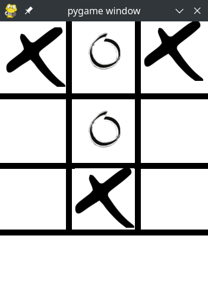

# 🎮 AI Tic-Tac-Toe

An unbeatable Tic-Tac-Toe game implemented in Python using Pygame, featuring an AI opponent powered by the Minimax algorithm.



## ✨ Features

- 🤖 Intelligent AI opponent using Minimax algorithm
- 🎯 Clean and intuitive graphical interface
- 🎨 Custom X and O graphics
- 🔄 Easy game reset functionality
- ⚡ Optimized performance
- 🎲 Random first moves by AI for varied gameplay

## 🚀 Getting Started

### Prerequisites

- Python 3.x
- Pygame library

### Installation

1. Clone the repository:
   ```bash
   git clone https://github.com/yourusername/ai-tic-tac-toe.git
   ```

2. Navigate to the project directory:
   ```bash
   cd ai-tic-tac-toe
   ```

3. Create and activate a virtual environment (optional but recommended):
   ```bash
   python -m venv venv
   source venv/bin/activate  # On Windows, use: venv\Scripts\activate
   ```

4. Install the required dependencies:
   ```bash
   pip install pygame
   ```

5. Run the game:
   ```bash
   python main.py
   ```